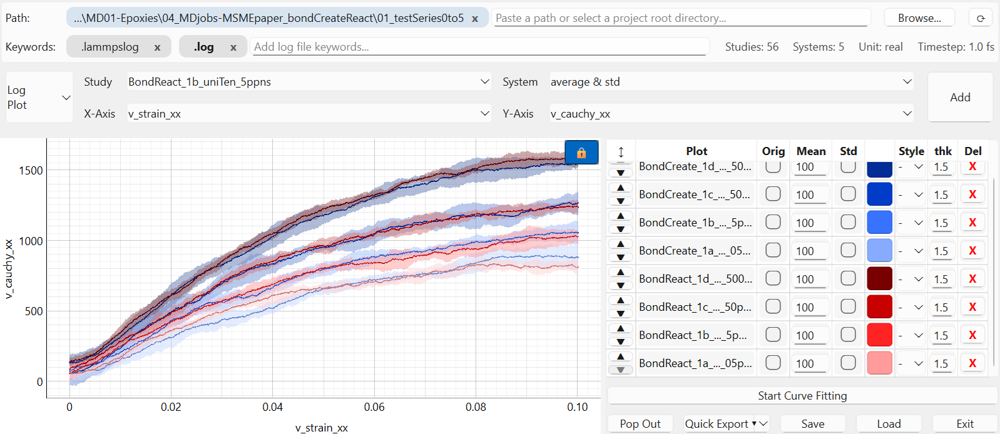
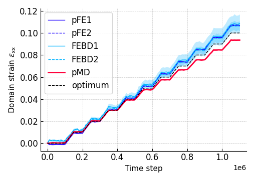

# LMPvisualizer

A desktop application for interactively exploring LAMMPS molecular dynamics output: thermo logs, trajectory dumps, and domain-based displacement/strain analysis.

| Mode | Features |
| --- | --- |
| `log` | Plot thermo data, average across systems, define custom properties, fit curves |
| `trj` | Visualize trajectories with playback, filtering, and heatmap coloring |
| `dsd` | Domain strain decomposition method on trajectories |

`dsd` implements the domain strain decomposition (DSD) method: particle displacements are projected onto one axis inside configurable domains (slices/boxes), averaged per box, and differentiated into strains for comparison against an end-to-end target strain [[1](#ref-1)–[3](#ref-3)].

## Quickstart

Start the app from the repository root (`python` on Windows, `python3` on Linux/macOS):

```sh
python main.py                       # boots into the neutral mode-selection panel
python main.py -mode log             # log | trj | dsd
python main.py -autoload off         # ask before restoring the per-mode autosave
```

## Installation

```sh
pip install -r requirements.txt      # on Linux, either apt get install one-by-one or create a venv
```

Linux needs the Qt6 system libraries for PyQt6, e.g. `sudo apt install libxcb-cursor0 libGL1 libEGL1`.
Video export additionally needs an `ffmpeg` program on your PATH, which cannot be installed via pip: Windows via `winget install ffmpeg` or ffmpeg.org, Linux via `sudo apt install ffmpeg`, macOS via `brew install ffmpeg`.

## Parsing simulation data

Enter the path of your simulation files in the path bar.
Studies and systems are read from the folder structure:

- **study** = grandparent folder (one study can hold several systems)
- **system** = parent folder

The file search uses the (custom) keywords specified, e.g. (default): `.lammpslog` / `.out` / `log.` for log mode, `.lammpstrj` / `.dump` for trajectory and DSD modes.
A keyword with a trailing (starting) dot matches file names starting (ending) with it, e.g. `in.` finds `in.myFile`; `.in` finds `myFile.in`.
If your project has an `input_files` folder, the app also picks up the simulation units and timestep and shows them in the top bar.

### Several project folders at once

The path bar can hold multiple projects (paths) as chips.
The Browse button and pasting a path adds one, the `x` removes it.
Right-click a chip to copy its full path to the clipboard.
Plots have their properties in a table row.
Each table row and plot belongs to their project chip: adding or removing a project keeps the other rows, and rows of a removed project disappear.
If two projects contain a study folder with the same name, the study list shows each with its path prefix so you can tell them apart.

## Modes

### Log mode



Plot thermo quantities (temperature, pressure, energies, volume, ...) or custom functions depending on them over steps or against each other.

- Pick Study, System, and logged/custom properties (on X-Axis and Y-Axis).
  Click `Add` to copy the plot: Plotting/Adding variants needs only few clicks.
- Each row can show the raw curve (Orig), a smoothed curve (Mean, with adjustable window and method via right-click on the Mean header), and a spread band (Std).
- With several y-axes, each gets its own axis on the side.
  The lock buttons align their zero lines or share their zoom. Right-click on it to align their 0 mark.
- Studies with several systems offer `average` and `average & std` to plot their average y values.
  If the runs have different lengths, a you can choose to truncate them or exclude systems.
- Custom properties let you combine thermo quantities into new quantities, e.g. total energy from potential plus kinetic energy.
  Add and edit them through the `Custom` entry in the axis dropdowns.
- Curve fitting: add a fit on a plot, pick Orig or Mean as source, define the function and parameters, and run the fit.

### Trajectory (trj) mode


Step through trajectory frames as scatter plots.

- Pick Study, System, and dumped properties (on X-Axis and Y-Axis).
  A player controls play/pause, speed (FPS), replay loop, the step slider, and the editable step range.
- Z-Filter restricts which atoms are shown based on another dump column/property, relative to the initial, current, or final frame, or a fixed step; left/right clicking in the appearing bar allows adding filtering subranges.
- Heatmap colors atoms by another column with the same reference choices and several gradients; click the scale numbers to pin the color range.
- Add one plot and table row with the `Add` buttom.
  Each plot/row stored in the right table pane stores its own axes, filter, heatmap, current step, view lock, and point style; switching rows restores and plots everything.
- The step slider range (min/max) is kept while you browse studies and systems, and widened back to the full trajectory when you load a different project.

### DSD mode (domain strain decomposition method)



Project 3D particle motion onto one axis and derive strains of subdomains, following the projection framework in [[1](#ref-1)] and the strain/error computation in [[2](#ref-2), [3](#ref-3)].

- One Study / System selection, plus a slice axis (the direction you project along), an observe axis (the displacement component), an optional Z-Filter (as in trj mode), and the plot type: `Displacement plot`, `Strain Over Step`, or `Strain Over Strain`.
- Domains divide the sample into boxes along the observe axis: set atom types, box count, arrangement and overlap, periodic boundary handling, weighted averaging, and optional splits that activate only specified parts of a domain.
- The displacement plot shows mean displacement per box with spread bands, particle counts (optional), and an end-to-end reference line (optimal strain under, e.g., PBCs).
  The strain plots show the actual tensile or shear strain evolving over steps or against the target strain (end-to-end reference), with an error table per domain.
- `Strain average` (strain plots, multi-system studies) aggregates all systems over their common timesteps.
- `Auto Preload` prepares trajectory indices and strain results in the background so playback and plotting is responsive.

## Sessions and autosave

Sessions store project paths, keywords, table rows, styles, view ranges, and plot settings in a `.json` file.
Typing or browsing to a session `.json` file in the path field loads that session and switches to its mode automatically.

- Autosaves live in `~/.LMPvisualizer/` as `autosave_log.json`, `autosave_trj.json`, `autosave_dsd.json` (one per mode), written whenever you switch modes or close the app.
  Autosaves update only when the table holds content, so an empty table keeps the previous autosave.
- If a session points at a folder that no longer exists, a dialog offers to relocate it, pick a different project, or reset.

## Export, pop-out, and video

- **Quick Export**: save the current figure as an image (PNG, JPEG, TIFF, SVG, PDF, ...) or dump the plotted data as CSV/TSV.
- **Pop Out**: open the current plot in an editor to adjust title, labels, fonts, legend, colors, line styles, log scales, and optionally LaTeX rendering.
  Settings can be stored as presets that travel with the session.
- **Video / GIF** (trajectory and DSD modes): render a step range to MP4/AVI/MOV (needs `ffmpeg`) or animated WebP/GIF, with options for frame rate, frame skipping, hidden axes/grid, and auto-cropping.

## Large trajectories

Trajectory files stay on disk: frames are read on demand, and a small companion index file (`.idx`) is generated on first loading so reopening is fast.
Use `Auto Preload` to bulk generate index files for multiple trajectories.

## References

DSD method and the MATLAB projection framework it builds on:

<a id="ref-0"></a>[0] Framework for projecting displacements of particles and nodes resulting from Capriccio method coupled deformation simulations to a one-dimensional representation. Zenodo: <https://zenodo.org/records/14796824>

<a id="ref-1"></a>[1] L. Laubert, "Establishing a framework for conducting comparative one- and multidimensional studies on the coupling of the finite element method with particle-based techniques", Project Thesis, Friedrich-Alexander-Universität Erlangen-Nürnberg (FAU), 2023.

<a id="ref-2"></a>[2] L. Laubert, F. Weber, and S. Pfaller, "Assessing the Capriccio method via one-dimensional systems for coupled continuum-particle simulations in various uniaxial load cases using a novel interdimensional comparison approach", Computer Methods in Applied Mechanics and Engineering, vol. 439, p. 117817, 2025. <https://doi.org/10.1016/j.cma.2025.117817>

<a id="ref-3"></a>[3] L. Laubert, F. Weber, F. Detrez, and S. Pfaller, "Approaching and overcoming the limitations of the multiscale Capriccio method for simulating the mechanical behavior of amorphous materials", International Journal of Engineering Science, vol. 217, p. 104317, 2025. <https://doi.org/10.1016/j.ijengsci.2025.104317>

## License

MIT License, Copyright (c) 2026 Lukas Laubert.
See `LICENSE`.